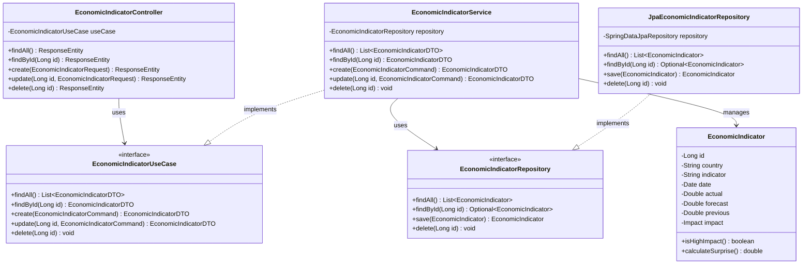

# バックエンドポートフォリオAPI アーキテクチャ設計

## 1. ヘキサゴナルアーキテクチャの概要

ヘキサゴナルアーキテクチャ（Ports and Adapters パターン）は、アプリケーションのビジネスロジックを外部要素（データベース、UI、外部サービスなど）から分離することを目的としています。これにより、中心となるドメインロジックをテスト可能で、技術的な実装の詳細から独立した状態に保ちます。

```
         ┌────────────────────────────────────┐
         │                                    │
         │         プライマリポート             │
         │   ┌───────────────────────────┐    │
         │   │                           │    │
         │   │                           │    │
         │   │                           │    │
┌────────┤   │                           │    ├────────┐
│        │   │                           │    │        │
│ REST   │   │      ドメインロジック      │    │  バッチ │
│ API    ◄───┤      (アプリケーションコア) │───►  処理   │
│        │   │                           │    │        │
└────────┤   │                           │    ├────────┘
         │   │                           │    │
         │   │                           │    │
         │   │                           │    │
         │   └───────────────────────────┘    │
         │         セカンダリポート            │
         │                                    │
         └────────────────────────────────────┘
                         ▲  ▲
                         │  │
           ┌─────────────┘  └─────────────┐
           │                              │
┌──────────▼──────────┐        ┌──────────▼──────────┐
│                     │        │                     │
│  データベースアダプター │        │  外部サービスアダプター │
│                     │        │                     │
└─────────────────────┘        └─────────────────────┘
           │                              │
           ▼                              ▼
      ┌────────┐                     ┌────────┐
      │        │                     │        │
      │  DB    │                     │ 外部API │
      │        │                     │        │
      └────────┘                     └────────┘
```

### 1.1 ヘキサゴナルアーキテクチャの主要概念

- **ポート**: アプリケーションとの相互作用点を定義するインターフェース
  - **プライマリポート**: アプリケーションに入力を提供するインターフェース（サービスインターフェースなど）
  - **セカンダリポート**: アプリケーションが外部リソースにアクセスするためのインターフェース（リポジトリインターフェースなど）

- **アダプター**: ポートを実装し、外部システムとの連携を担当
  - **プライマリアダプター**: 外部からのリクエストをアプリケーションに送る（RESTコントローラーなど）
  - **セカンダリアダプター**: アプリケーションのリクエストを外部システム用に変換（リポジトリ実装など）

- **アプリケーションコア**: ビジネスロジックを含む中心部分（ドメインモデル、サービス）

## 2. ヘキサゴナルアーキテクチャの実装

### 2.1 パッケージ構造

```
com.portfolio.backend_portfolio_api/
├── application/                  # アプリケーション層 (ユースケース、アプリケーションサービス)
│   ├── dto/                      # データ転送オブジェクト
│   ├── port/                     # ポート定義
│   │   ├── in/                   # プライマリポート
│   │   └── out/                  # セカンダリポート
│   └── service/                  # アプリケーションサービス（ユースケース実装）
│
├── domain/                       # ドメイン層 (ビジネスエンティティ、ロジック)
│   ├── model/                    # ドメインモデル
│   ├── service/                  # ドメインサービス
│   └── exception/                # ドメイン例外
│
├── adapter/                      # アダプター層 (ポート実装)
│   ├── in/                       # プライマリアダプター
│   │   ├── web/                  # REST APIコントローラー
│   │   └── batch/                # バッチ処理アダプター
│   └── out/                      # セカンダリアダプター
│       ├── persistence/          # データベースアダプター
│       └── external/             # 外部サービスアダプター
│
└── infrastructure/               # インフラストラクチャ層 (設定、共通部品)
    ├── config/                   # 設定クラス
    ├── security/                 # セキュリティ設定
    ├── exception/                # グローバル例外ハンドリング
    └── util/                     # ユーティリティクラス
```

### 2.2 クラス相関図



## 3. レイヤー詳細設計

### 3.1 ドメイン層

ドメイン層には技術的な詳細や外部依存関係を含まず、純粋なビジネスロジックのみを含みます。

#### 3.1.1 ドメインモデル

```java
// 経済指標のドメインモデル
public class EconomicIndicator {
    private Long id;
    private LocalDateTime date;
    private String country;
    private String indicator;
    private Double actual;
    private Double forecast;
    private Double previous;
    private Impact impact;
    private List<VolatilityData> volatilityData;
    
    // ビジネスロジック
    public boolean isHighImpact() {
        return Impact.HIGH.equals(this.impact);
    }
    
    public double calculateSurprise() {
        if (actual == null || forecast == null) return 0;
        return actual - forecast;
    }
    
    public boolean isBetterThanExpected() {
        return calculateSurprise() > 0;
    }
}

// 影響度を表す列挙型
public enum Impact {
    HIGH, MEDIUM, LOW
}
```

#### 3.1.2 ドメインサービス

ドメインサービスは、単一のエンティティに属さない複雑なビジネスロジックを担当します。

```java
public class VolatilityCalculationService {
    // 市場データからボラティリティを計算
    public double calculateDailyVolatility(double high, double low) {
        return (high - low) / low * 100;
    }
    
    // ボラティリティのカテゴライズ
    public VolatilityCategory categorize(double volatility, List<Double> historicalData) {
        double percentile33 = calculatePercentile(historicalData, 33);
        double percentile67 = calculatePercentile(historicalData, 67);
        
        if (volatility < percentile33) {
            return VolatilityCategory.LOW;
        } else if (volatility < percentile67) {
            return VolatilityCategory.MEDIUM;
        } else {
            return VolatilityCategory.HIGH;
        }
    }
    
    private double calculatePercentile(List<Double> data, int percentile) {
        // パーセンタイル計算ロジック
        // ...
        return result;
    }
}
```

### 3.2 アプリケーション層

アプリケーション層は、ユースケースを実装し、ドメインモデルを操作するサービスを提供します。

#### 3.2.1 ポート定義

**プライマリポート**（インバウンド）:
```java
// 経済指標のユースケースインターフェース（プライマリポート）
public interface EconomicIndicatorUseCase {
    List<EconomicIndicatorDTO> findAll();
    EconomicIndicatorDTO findById(Long id);
    EconomicIndicatorDTO create(EconomicIndicatorCommand command);
    EconomicIndicatorDTO update(Long id, EconomicIndicatorCommand command);
    void delete(Long id);
}

// ボラティリティ計算のユースケースインターフェース（プライマリポート）
public interface VolatilityCalculationUseCase {
    List<VolatilityDataDTO> calculateForIndicator(Long indicatorId, LocalDateTime startDate, LocalDateTime endDate);
    StatisticalSummaryDTO getStatisticalSummary(Long indicatorId);
}
```

**セカンダリポート**（アウトバウンド）:
```java
// 経済指標のリポジトリインターフェース（セカンダリポート）
public interface EconomicIndicatorRepository {
    List<EconomicIndicator> findAll();
    Optional<EconomicIndicator> findById(Long id);
    List<EconomicIndicator> findByCountryAndDateBetween(String country, LocalDateTime startDate, LocalDateTime endDate);
    EconomicIndicator save(EconomicIndicator indicator);
    void delete(Long id);
}

// ボラティリティデータのリポジトリインターフェース（セカンダリポート）
public interface VolatilityDataRepository {
    List<VolatilityData> findByIndicatorId(Long indicatorId);
    List<VolatilityData> findByIndicatorIdAndDateBetween(Long indicatorId, LocalDateTime startDate, LocalDateTime endDate);
    VolatilityData save(VolatilityData data);
    void deleteByIndicatorId(Long indicatorId);
}
```

#### 3.2.2 アプリケーションサービス

```java
@Service
@Transactional
public class EconomicIndicatorService implements EconomicIndicatorUseCase {
    private final EconomicIndicatorRepository economicIndicatorRepository;
    
    public EconomicIndicatorService(EconomicIndicatorRepository economicIndicatorRepository) {
        this.economicIndicatorRepository = economicIndicatorRepository;
    }
    
    @Override
    @Transactional(readOnly = true)
    public List<EconomicIndicatorDTO> findAll() {
        return economicIndicatorRepository.findAll().stream()
                .map(this::mapToDTO)
                .collect(Collectors.toList());
    }
    
    @Override
    @Transactional(readOnly = true)
    public EconomicIndicatorDTO findById(Long id) {
        return economicIndicatorRepository.findById(id)
                .map(this::mapToDTO)
                .orElseThrow(() -> new ResourceNotFoundException("EconomicIndicator", "id", id));
    }
    
    @Override
    public EconomicIndicatorDTO create(EconomicIndicatorCommand command) {
        // バリデーション
        validateCommand(command);
        
        // ドメインオブジェクト生成
        EconomicIndicator indicator = new EconomicIndicator();
        indicator.setCountry(command.getCountry());
        indicator.setIndicator(command.getIndicator());
        indicator.setDate(command.getDate());
        indicator.setActual(command.getActual());
        indicator.setForecast(command.getForecast());
        indicator.setPrevious(command.getPrevious());
        indicator.setImpact(command.getImpact());
        
        // 永続化
        indicator = economicIndicatorRepository.save(indicator);
        
        return mapToDTO(indicator);
    }
    
    @Override
    public EconomicIndicatorDTO update(Long id, EconomicIndicatorCommand command) {
        // 存在確認
        EconomicIndicator indicator = economicIndicatorRepository.findById(id)
                .orElseThrow(() -> new ResourceNotFoundException("EconomicIndicator", "id", id));
        
        // バリデーション
        validateCommand(command);
        
        // 更新
        indicator.setCountry(command.getCountry());
        indicator.setIndicator(command.getIndicator());
        indicator.setDate(command.getDate());
        indicator.setActual(command.getActual());
        indicator.setForecast(command.getForecast());
        indicator.setPrevious(command.getPrevious());
        indicator.setImpact(command.getImpact());
        
        // 永続化
        indicator = economicIndicatorRepository.save(indicator);
        
        return mapToDTO(indicator);
    }
    
    @Override
    public void delete(Long id) {
        if (!economicIndicatorRepository.existsById(id)) {
            throw new ResourceNotFoundException("EconomicIndicator", "id", id);
        }
        
        economicIndicatorRepository.deleteById(id);
    }
    
    // DTOマッピング
    private EconomicIndicatorDTO mapToDTO(EconomicIndicator indicator) {
        EconomicIndicatorDTO dto = new EconomicIndicatorDTO();
        dto.setId(indicator.getId());
        dto.setCountry(indicator.getCountry());
        dto.setIndicator(indicator.getIndicator());
        dto.setDate(indicator.getDate());
        dto.setActual(indicator.getActual());
        dto.setForecast(indicator.getForecast());
        dto.setPrevious(indicator.getPrevious());
        dto.setImpact(indicator.getImpact());
        dto.setSurprise(indicator.calculateSurprise());
        dto.setBetterThanExpected(indicator.isBetterThanExpected());
        
        return dto;
    }
    
    // バリデーション
    private void validateCommand(EconomicIndicatorCommand command) {
        // バリデーションロジック
        if (command.getCountry() == null || command.getCountry().trim().isEmpty()) {
            throw new ValidationException("country", "国名は必須です");
        }
        
        if (command.getIndicator() == null || command.getIndicator().trim().isEmpty()) {
            throw new ValidationException("indicator", "指標名は必須です");
        }
        
        if (command.getDate() == null) {
            throw new ValidationException("date", "日付は必須です");
        }
        
        // その他のバリデーション...
    }
}
```

### 3.3 アダプター層

#### 3.3.1 プライマリアダプター（インバウンド）

```java
@RestController
@RequestMapping("/api/v1/indicators")
public class EconomicIndicatorController {
    private final EconomicIndicatorUseCase economicIndicatorUseCase;
    
    public EconomicIndicatorController(EconomicIndicatorUseCase economicIndicatorUseCase) {
        this.economicIndicatorUseCase = economicIndicatorUseCase;
    }
    
    @GetMapping
    public ResponseEntity<ApiResponse<List<EconomicIndicatorDTO>>> findAll() {
        List<EconomicIndicatorDTO> indicators = economicIndicatorUseCase.findAll();
        return ResponseEntity.ok(ApiResponse.success(indicators));
    }
    
    @GetMapping("/{id}")
    public ResponseEntity<ApiResponse<EconomicIndicatorDTO>> findById(@PathVariable Long id) {
        EconomicIndicatorDTO indicator = economicIndicatorUseCase.findById(id);
        return ResponseEntity.ok(ApiResponse.success(indicator));
    }
    
    @PostMapping
    public ResponseEntity<ApiResponse<EconomicIndicatorDTO>> create(@Valid @RequestBody EconomicIndicatorRequest request) {
        EconomicIndicatorCommand command = mapToCommand(request);
        EconomicIndicatorDTO created = economicIndicatorUseCase.create(command);
        return ResponseEntity
                .status(HttpStatus.CREATED)
                .body(ApiResponse.success(created));
    }
    
    @PutMapping("/{id}")
    public ResponseEntity<ApiResponse<EconomicIndicatorDTO>> update(
            @PathVariable Long id, 
            @Valid @RequestBody EconomicIndicatorRequest request) {
        EconomicIndicatorCommand command = mapToCommand(request);
        EconomicIndicatorDTO updated = economicIndicatorUseCase.update(id, command);
        return ResponseEntity.ok(ApiResponse.success(updated));
    }
    
    @DeleteMapping("/{id}")
    public ResponseEntity<ApiResponse<Void>> delete(@PathVariable Long id) {
        economicIndicatorUseCase.delete(id);
        return ResponseEntity.ok(ApiResponse.success(null));
    }
    
    // リクエストをコマンドに変換
    private EconomicIndicatorCommand mapToCommand(EconomicIndicatorRequest request) {
        EconomicIndicatorCommand command = new EconomicIndicatorCommand();
        command.setCountry(request.getCountry());
        command.setIndicator(request.getIndicator());
        command.setDate(request.getDate());
        command.setActual(request.getActual());
        command.setForecast(request.getForecast());
        command.setPrevious(request.getPrevious());
        command.setImpact(Impact.valueOf(request.getImpact()));
        
        return command;
    }
}
```

#### 3.3.2 セカンダリアダプター（アウトバウンド）

```java
@Repository
public class JpaEconomicIndicatorRepository implements EconomicIndicatorRepository {
    private final SpringDataEconomicIndicatorRepository repository;
    
    public JpaEconomicIndicatorRepository(SpringDataEconomicIndicatorRepository repository) {
        this.repository = repository;
    }
    
    @Override
    public List<EconomicIndicator> findAll() {
        return repository.findAll().stream()
                .map(this::mapToDomainEntity)
                .collect(Collectors.toList());
    }
    
    @Override
    public Optional<EconomicIndicator> findById(Long id) {
        return repository.findById(id).map(this::mapToDomainEntity);
    }
    
    @Override
    public List<EconomicIndicator> findByCountryAndDateBetween(String country, LocalDateTime startDate, LocalDateTime endDate) {
        return repository.findByCountryAndDateBetween(country, startDate, endDate).stream()
                .map(this::mapToDomainEntity)
                .collect(Collectors.toList());
    }
    
    @Override
    public EconomicIndicator save(EconomicIndicator indicator) {
        EconomicIndicatorJpaEntity entity = mapToJpaEntity(indicator);
        entity = repository.save(entity);
        return mapToDomainEntity(entity);
    }
    
    @Override
    public void delete(Long id) {
        repository.deleteById(id);
    }
    
    // JPAエンティティをドメインエンティティに変換
    private EconomicIndicator mapToDomainEntity(EconomicIndicatorJpaEntity entity) {
        EconomicIndicator indicator = new EconomicIndicator();
        indicator.setId(entity.getId());
        indicator.setCountry(entity.getCountry());
        indicator.setIndicator(entity.getIndicator());
        indicator.setDate(entity.getDate());
        indicator.setActual(entity.getActual());
        indicator.setForecast(entity.getForecast());
        indicator.setPrevious(entity.getPrevious());
        indicator.setImpact(Impact.valueOf(entity.getImpact()));
        
        // 関連エンティティのマッピング...
        
        return indicator;
    }
    
    // ドメインエンティティをJPAエンティティに変換
    private EconomicIndicatorJpaEntity mapToJpaEntity(EconomicIndicator indicator) {
        EconomicIndicatorJpaEntity entity = new EconomicIndicatorJpaEntity();
        
        if (indicator.getId() != null) {
            entity.setId(indicator.getId());
        }
        
        entity.setCountry(indicator.getCountry());
        entity.setIndicator(indicator.getIndicator());
        entity.setDate(indicator.getDate());
        entity.setActual(indicator.getActual());
        entity.setForecast(indicator.getForecast());
        entity.setPrevious(indicator.getPrevious());
        entity.setImpact(indicator.getImpact().name());
        
        // 関連エンティティのマッピング...
        
        return entity;
    }
}

// Spring Data JPA リポジトリインターフェース
interface SpringDataEconomicIndicatorRepository extends JpaRepository<EconomicIndicatorJpaEntity, Long> {
    List<EconomicIndicatorJpaEntity> findByCountryAndDateBetween(
            String country, LocalDateTime startDate, LocalDateTime endDate);
}
```

### 3.4 JPA永続化エンティティ

```java
@Entity
@Table(name = "economic_indicators")
public class EconomicIndicatorJpaEntity {
    @Id
    @GeneratedValue(strategy = GenerationType.IDENTITY)
    private Long id;
    
    @Column(nullable = false, length = 50)
    private String country;
    
    @Column(nullable = false, length = 100)
    private String indicator;
    
    @Column(nullable = false)
    private LocalDateTime date;
    
    @Column
    private Double actual;
    
    @Column
    private Double forecast;
    
    @Column
    private Double previous;
    
    @Column(nullable = false, length = 10)
    private String impact;
    
    @OneToMany(mappedBy = "economicIndicator", cascade = CascadeType.ALL, orphanRemoval = true)
    private List<VolatilityDataJpaEntity> volatilityData = new ArrayList<>();
    
    // ゲッター・セッター...
}
```

## 4. 利点と主要な品質特性

### 4.1 テスト容易性

ヘキサゴナルアーキテクチャは、外部依存関係からコアビジネスロジックを分離するため、単体テストが容易になります。

```java
@ExtendWith(MockitoExtension.class)
class EconomicIndicatorServiceTest {
    @Mock
    private EconomicIndicatorRepository repository;
    
    @InjectMocks
    private EconomicIndicatorService service;
    
    @Test
    void givenValidCommand_whenCreate_thenSucceed() {
        // Given
        EconomicIndicatorCommand command = new EconomicIndicatorCommand();
        command.setCountry("US");
        command.setIndicator("GDP");
        command.setDate(LocalDateTime.now());
        command.setImpact(Impact.HIGH);
        
        EconomicIndicator savedIndicator = new EconomicIndicator();
        savedIndicator.setId(1L);
        savedIndicator.setCountry(command.getCountry());
        savedIndicator.setIndicator(command.getIndicator());
        savedIndicator.setDate(command.getDate());
        savedIndicator.setImpact(command.getImpact());
        
        when(repository.save(any(EconomicIndicator.class))).thenReturn(savedIndicator);
        
        // When
        EconomicIndicatorDTO result = service.create(command);
        
        // Then
        assertNotNull(result);
        assertEquals(1L, result.getId());
        assertEquals("US", result.getCountry());
        assertEquals("GDP", result.getIndicator());
        assertEquals(Impact.HIGH, result.getImpact());
        
        verify(repository).save(any(EconomicIndicator.class));
    }
}
```

### 4.2 保守性と拡張性

新しい機能追加やインフラストラクチャの変更が容易です。例えば、データベースをMySQLからPostgreSQLに変更する場合、セカンダリアダプターの実装のみを変更すればよく、ドメインロジックには影響しません。

### 4.3 依存関係逆転の原則

ドメインとアプリケーション層が技術的な実装詳細に依存せず、むしろインターフェース（ポート）を通じて依存性が逆転します。これにより、ビジネスロジックが技術的な変更に左右されにくくなります。

## 5. 実装ガイドラインと注意点

### 5.1 ドメイン層のピュア性

- ドメイン層には外部フレームワークに依存するアノテーションやコードを含めない
- ドメインモデルは純粋なJavaオブジェクトとして実装
- ビジネスルールはドメインモデル内に封じ込める

### 5.2 適切なトランザクション境界

- トランザクション境界はアプリケーション層で定義
- `@Transactional`アノテーションはアプリケーションサービスのメソッドに配置

### 5.3 マッピング戦略

- ドメインモデル←→JPAエンティティのマッピングはセカンダリアダプターの責務
- アプリケーションサービス←→コントローラーのDTOマッピングはそれぞれの層で対応

### 5.4 例外処理

- ドメイン層では技術に依存しない例外を定義
- アダプター層で例外を適切に変換

## 6. 実装フロー図

以下は経済指標データの取得と作成の流れをシーケンス図で表現しています。

### 6.1 データ取得フロー


### 6.2 データ作成フロー


## 7. パフォーマンス最適化

### 7.1 データベースアクセスの最適化

ヘキサゴナルアーキテクチャを採用しても、パフォーマンスを最適化するためのテクニックを適用できます：

- 適切なインデックス作成
- N+1問題解決のためのフェッチ戦略
- 必要に応じたキャッシング

```java
// インデックス定義の例
@Entity
@Table(name = "economic_indicators", indexes = {
    @Index(name = "idx_country_date", columnList = "country,date"),
    @Index(name = "idx_indicator_impact", columnList = "indicator,impact")
})
public class EconomicIndicatorJpaEntity { ... }

// フェッチグラフの使用例
@EntityGraph(attributePaths = {"volatilityData"})
Optional<EconomicIndicatorJpaEntity> findWithVolatilityDataById(Long id);
```

## 8. API設計

ヘキサゴナルアーキテクチャの利点を活かした、明確なAPIエンドポイント設計：

| メソッド | エンドポイント | 説明 | レスポンスコード |
|---------|---------------|------|----------------|
| GET     | /api/v1/indicators | 全ての経済指標を取得 | 200 OK |
| GET     | /api/v1/indicators/{id} | 指定IDの経済指標を取得 | 200 OK, 404 Not Found |
| POST    | /api/v1/indicators | 新しい経済指標を作成 | 201 Created, 400 Bad Request |
| PUT     | /api/v1/indicators/{id} | 指定IDの経済指標を更新 | 200 OK, 404 Not Found, 400 Bad Request |
| DELETE  | /api/v1/indicators/{id} | 指定IDの経済指標を削除 | 204 No Content, 404 Not Found |
| GET     | /api/v1/volatilities/indicator/{id} | 指標に関連するボラティリティデータを取得 | 200 OK, 404 Not Found |
| GET     | /api/v1/statistics/indicator/{id} | 指標の統計サマリーを取得 | 200 OK, 404 Not Found |

## 9. 結論

ヘキサゴナルアーキテクチャの採用により、バックエンドポートフォリオAPIは以下のメリットを獲得します：

1. **ビジネスロジックの分離**: 技術的な詳細から独立したドメインロジック
2. **テスト容易性**: モックやスタブを使用した包括的なテストが容易
3. **拡張性**: 新しいインターフェースや機能追加が容易
4. **保守性**: 技術的な選択の変更がドメインに影響しない
5. **依存関係の明確化**: クリーンな依存関係グラフ

これらの特性により、長期的なメンテナンスが容易で、新しい要件に対応しやすいシステムを構築することが可能になります。 